# Test automation project for [Petstore](https://petstore.swagger.io/)

# <a name="TableOfContents">Table of contents</a>
+ [Description](#Description)
+ [Tools and technologies](#Technology)
+ [How to run](#HowToRun)
    + [Run in Jenkins](#RunInJenkins)
+ [Telegram Notifications](#TelegramNotifications)
+ [Test results report in Allure Report](#AllureReport)
+ [Allure TestOps integration](#AllureTestOps)
+ [Jira integration](#Jira)


# <a name="Description">Description</a>
The test project consists of API tests.

[Back to the table of contents ⬆](#TableOfContents)

# <a name="Technology">Tools and a technologies</a>

<p  align="center">
  
  
  
  
  
  
  
  
  
</p>

The autotests in this project are written in `Java` using `Rest Assured` for ui tests and in `Java` using `Selenide`+ `Appium` for mobile tests.\
`Rest Assured` acts as a wrapper for the http client.\
`JUnit 5` is used as a unit testing library.\
`Jenkins` - CI/CD for running tests remotely.\
`Allure Report` - for test results visualisation.\
`Telegram Bot` - for test results notifications.\
`Allure TestOps` - as Test Management System.

[Back to the table of contents ⬆](#TableOfContents)

# <a name="HowToRun">How to run</a>

To run locally the following command is used:
```bash
gradle clean test
```
Remote launch via parameter transfer
```bash
gradle clean test
-Denv=test
-DBaseUri=https://petstore.swagger.io
-DbasePath=/v2
```

[Back to the table of contents ⬆](#TableOfContents)

## <a name="RunInJenkins">Run in [Jenkins](https://jenkins.autotests.cloud/job/C20-miserylab-api_test_project/)</a>
Main page of the build:

<p  align="center">
  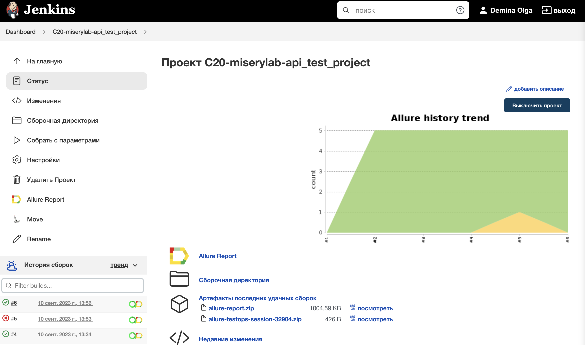
</p>

Parameters:

<p  align="center">
  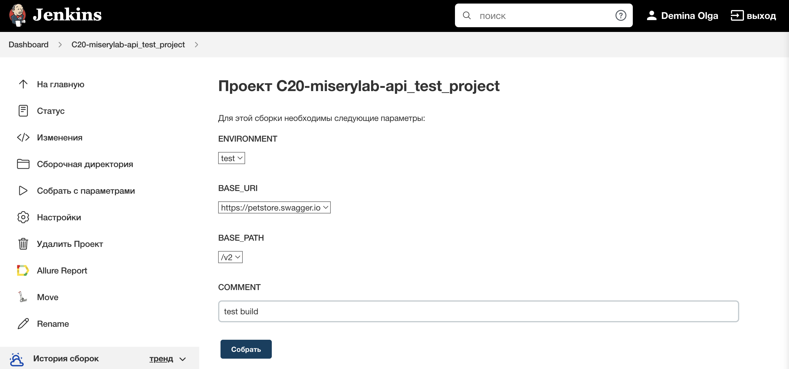
</p>

After the build is done the test results are available in:
>- <code><strong>*Allure Report*</strong></code>
>- <code><strong>*Allure TestOps*</strong></code>

<p  align="center">
  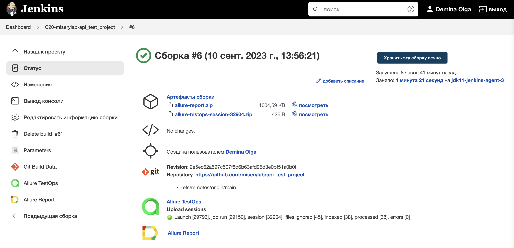
</p>


[Back to the table of contents ⬆](#TableOfContents)


# <a name="TelegramNotifications">Telegram Notifications</a>
Telegram bot sends a brief report to a specified telegram chat by results of each build.
<p  align="center">
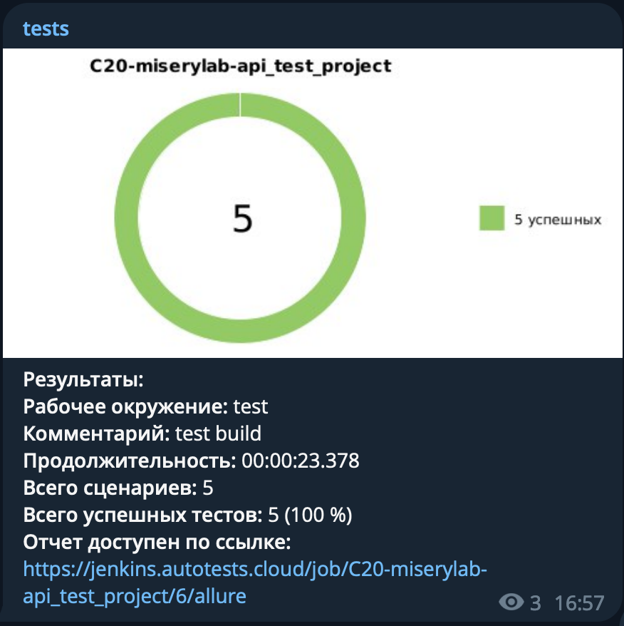
</p>


[Back to the table of contents ⬆](#TableOfContents)

# <a name="AllureReport">Test results report in [Allure Report](https://jenkins.autotests.cloud/job/C20-miserylab-api_test_project/6/allure/)</a>

<p align="center">
  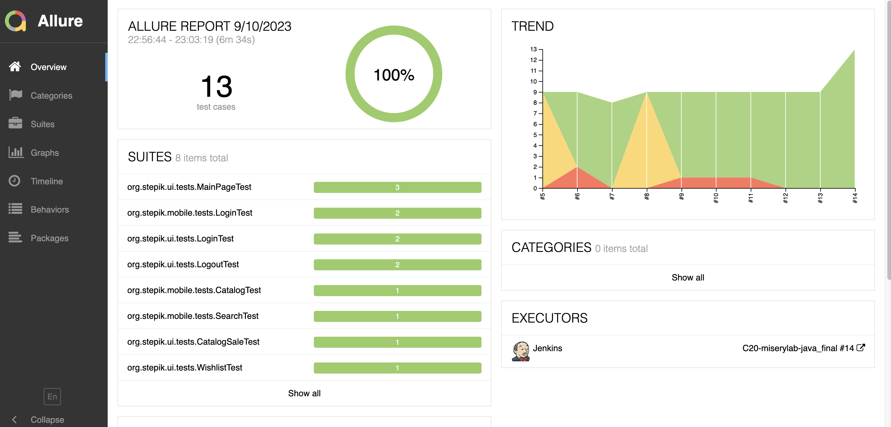
</p>

<p align="center">
  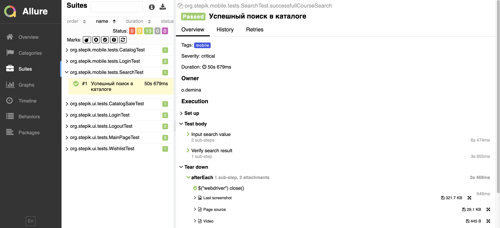
</p>

Also additional test artifacts are available:
>- Page Source
>- Screenshot
>- Browser logs
>- Video

<p align="center">
  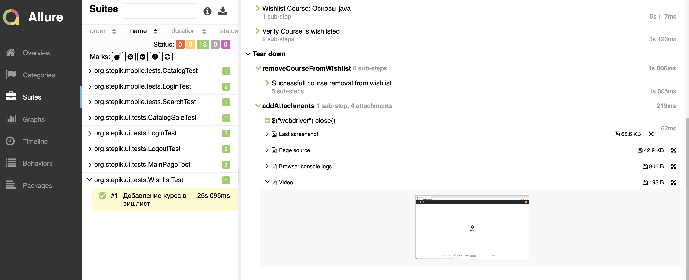
</p>

[Back to the table of contents ⬆](#TableOfContents)

# <a name="AllureTestOps">[Allure TestOps](https://allure.autotests.cloud/project/3666/dashboards) integration</a>
> The link can be accessed only by authorized users.

## <a name="AllureTestOpsProject">Project in Allure TestOps</a>

<p align="center">
  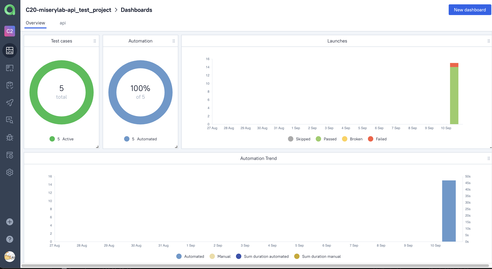
</p>

<p align="center">
  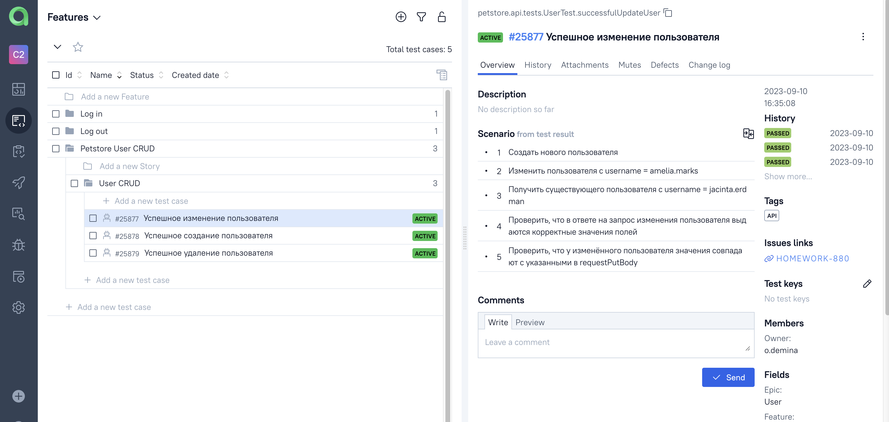
</p>

<p align="center">
  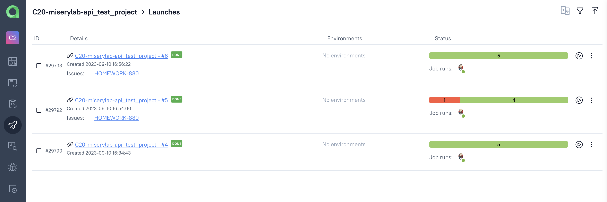
</p>


[Back to the table of contents ⬆](#TableOfContents)

# <a name="Jira">[Jira](https://jira.autotests.cloud/browse/HOMEWORK-880) integration</a>
> The link can be accessed only by authorized users.

<p align="center">
  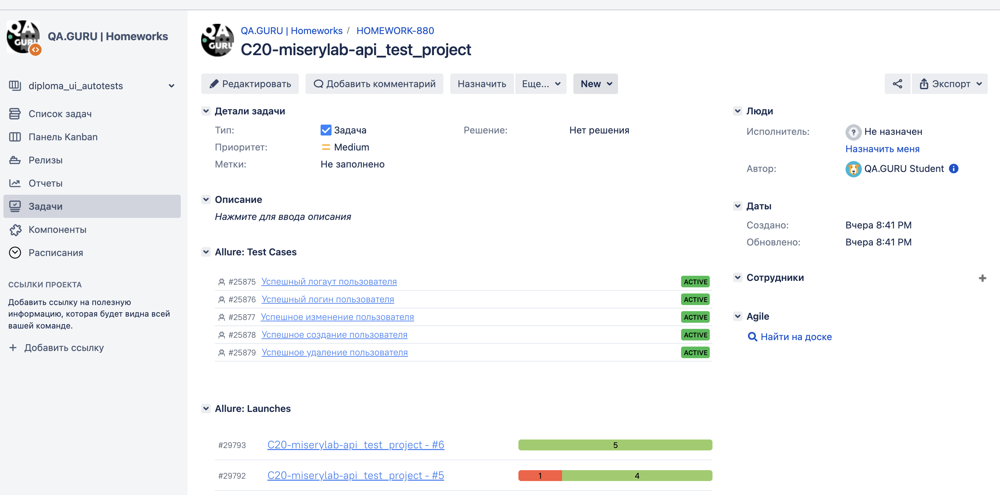
</p>

[Back to the table of contents ⬆](#TableOfContents)
